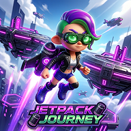

  

# Jetpack Journey

  <em>A 3D Platformer built in Unreal Engine 5 focusing on dynamic movement and fuel-based flight mechanics.</em>

## 📖 Description

**Jetpack Journey** is a 3D platformer where the player navigates through complex levels using a mix of traditional walking and a dynamic jetpack thruster system. The game focuses on precise platforming, strategic fuel management, and interacting with dynamic level elements like pressure plates and moving platforms. Built using Unreal Engine 5, the project leverages advanced animation systems, blueprint logic, and optimized level design techniques.

---

## 🎮 Inputs & Controls

The game utilizes a standard keyboard and mouse setup, designed to give the player precise control over both ground and aerial movement.

| Action | Key / Input | Description |
| :--- | :--- | :--- |
| **Move Forward** | `W` | Moves the character forward. |
| **Move Backward** | `S` | Moves the character backward. |
| **Move Left** | `A` | Moves the character left. |
| **Move Right** | `D` | Moves the character right. |
| **Look / Camera** | `Mouse` | Controls the camera pitch and yaw. |
| **Thruster / Fly** | `Shift` (Hold) | Activates the jetpack, consuming fuel and propelling the character upwards. |
| **Pause Game** | `Esc` | Opens the in-game pause menu. |

---

## 🕹️ Gameplay Logic & Mechanics

### Character Movement
The core of the game relies on a versatile **Character Movement Component**, seamlessly blending two distinct states:
*   **Walking Mode:** Standard ground traversal. When grounded, the character's rotation automatically aligns with the direction of movement (Velocity), while the camera remains independently controlled by the mouse for a better view of the surroundings.
*   **Flying Mode:** Engaged via the jetpack thruster. While in the air, the character's rotation locks to follow the camera's rotation (Control Rotation). This allows the player to aim their trajectory precisely using the mouse while navigating mid-air platforming challenges.

### Fuel System
Flight is strictly governed by a resource management system:
*   **Consumption:** Holding the thruster input drains fuel over time.
*   **Collection:** Players must actively seek out and collect fuel pickups scattered throughout the level to maintain their ability to fly and clear larger gaps.

### Dynamic Platforming
The levels are built with interactive obstacles to test the player's movement skills:
*   **Floating Platforms:** Static platforms suspended in the air.
*   **Ping-Pong Platforms:** Moving platforms that continuously travel back and forth between defined waypoints.
*   **Pressure Plates:** Interactive triggers placed in the environment. Stepping on a pressure plate will send a signal to activate specific dormant platforms, adding a puzzle element to traversal.

### Level Progression
*   **End Goal:** The primary objective of each level is to successfully navigate the environment, manage fuel, and reach the final platform to complete the stage.

---

## 🖥️ UI & Menus

The game features a complete, self-contained UI flow to handle game states:
1.  **Start Menu:** The initial screen providing entry into the game level.
2.  **Pause Menu:** Accessible during gameplay to pause the action, allowing the player to resume or quit.
3.  **End Menu:** A victory screen that triggers when the player successfully steps on the final goal platform.

---

## 🛠️ Technical Implementation Details

The project utilizes several key Unreal Engine 5 features to achieve its functionality:

### Blueprint Logic & Interfaces
*   **Core Systems:** Character movement, fuel management, and UI logic are entirely scripted using Unreal Blueprints.
*   **Blueprint Interfaces (BPI):** Used extensively for decoupled communication between actors. For example, pressure plates use an interface to communicate with moving platforms without needing direct, hard-coded references to them.

### Animation Systems
*   **Animation Blueprints:** Drives the character's skeletal mesh animations.
*   **Blendspaces:** Smoothly interpolates between idle, walking, and running animations based on the character's speed and direction.
*   **State Machines:** Manages the logical transitions between distinct animation states (e.g., Grounded -> Airborne -> Thruster Active).

### Level Design & Optimization
*   **Packed Level Actors (PLAs) / Instances:** Used to create reusable, optimized environmental prefabs. This ensures that repeating elements (like specific platform groupings or structures) are highly performant and easy to iterate upon across different levels.

### Audio
*   **Sound Design:** Integrated sound effects for thruster activation, item collection (fuel), UI interaction, and ambient environment sounds to enhance game feel.

---

## 📸 Screenshots

  

**Gameplay Gallery:**

  
  

  
  

  
  

